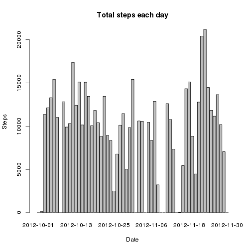

# Reproducible Research: Peer Assessment 1

### Loading and preprocessing the data

Loading the data and transforming the data into a format suitable for analysis:

<pre class="knitr r">fileUrl &lt;- &quot;https://d396qusza40orc.cloudfront.net/repdata/data/activity.zip&quot;
download.file( fileUrl,destfile=&quot;activity.zip&quot; )
system( &quot;unzip -o activity.zip&quot; )
activity &lt;- read.csv(&quot;activity.csv&quot;)
</pre>

<pre class="knitr r">library( dplyr )
activity &lt;- tbl_df( activity )
</pre>

### Mean total number of steps taken per day

I ignore the missing values in the dataset for this part of the assignment.

1. Calculating the total number of steps taken per day: 

<pre class="knitr r">plot_data &lt;- group_by( activity, date ) %&gt;%
    summarize( steps_sum = sum(steps,na.rm=TRUE) )
</pre>

2. Making a histogram of the total number of steps taken each day:

<pre class="knitr r">#png( file=&quot;plot_sum_date.png&quot;,width = 480,height = 480 )
with(plot_data, barplot( plot_data$steps_sum, names.arg=plot_data$date, xlab=&quot;Date&quot;, ylab=&quot;Steps&quot;, main=&quot;Total steps each day&quot; ))
</pre>

<pre class="knitr r">#dev.off()
</pre>

3. Calculating and reporting the mean and median of the total number of steps taken per day:

<pre class="knitr r">steps_mean &lt;- mean( plot_data$steps_sum,na.rm=TRUE )
print( paste(&quot;Mean of total number of steps taken per day:&quot;,steps_mean ) )
</pre>

<pre class="knitr r">## [1] &quot;Mean of total number of steps taken per day: 9354.22950819672&quot;
</pre>

<pre class="knitr r">steps_median &lt;- median( plot_data$steps_sum,na.rm=TRUE )
print( paste(&quot;Median of total number of steps taken per day:&quot;,steps_median ) )
</pre>

<pre class="knitr r">## [1] &quot;Median of total number of steps taken per day: 10395&quot;
</pre>

### Average daily activity pattern

1. Making a time series plot of the 5-minute interval (x-axis) and the average number of steps taken, averaged across all days (y-axis):

<pre class="knitr r">plot_data &lt;- group_by( activity, interval ) %&gt;%
    summarize( steps_sum    =    mean(steps, na.rm=TRUE))
#png( file=&quot;plot_sum_time.png&quot;,width = 480,height = 480 )
with(plot_data, plot( interval, steps_sum, type=&quot;l&quot;, xlab=&quot;5-min interval&quot;, ylab=&quot;Steps&quot;, main=&quot;Total steps each interval&quot; ))
</pre>

<pre class="knitr r">#dev.off()
</pre>

2. Getting 5-minute interval, on average across all the days in the dataset, contains the maximum number of steps:

<pre class="knitr r">max_int &lt;- plot_data[ which( plot_data$steps_sum == max(plot_data$steps_sum)), ]
print( paste(&quot;5-minute interval contains the maximum number of steps is&quot;,max_int$interval) )
</pre>

<pre class="knitr r">## [1] &quot;5-minute interval contains the maximum number of steps is 835&quot;
</pre>

### Imputing missing values

This dataset contains a number of days/intervals where there are missing values (coded as NA). The presence of missing days may introduce bias into some calculations or summaries of the data.

1. Calculating and reporting the total number of missing values in the dataset:

<pre class="knitr r">print(paste(&quot;Total number of missing values in the dataset is&quot;,sum(is.na(activity$steps))))
</pre>

<pre class="knitr r">## [1] &quot;Total number of missing values in the dataset is 2304&quot;
</pre>

2. Replacing all of the missing values in the dataset with the mean for that 5-minute interval:

<pre class="knitr r">activity_f &lt;- group_by( activity, interval )
activity_f &lt;- mutate( activity_f, steps_m = mean(steps,na.rm=TRUE))
</pre>

3. Creating a new dataset that is equal to the original dataset but with the missing data filled in:

<pre class="knitr r">activity_f &lt;- activity_f %&gt;%
    mutate( steps = if_else(is.na(steps), as.integer(steps_m), steps) )
activity_f &lt;- select(activity_f, -steps_m)
</pre>

4. Making a histogram of the total number of steps taken each day and calculating and reporting the mean and median total number of steps taken per day:

<pre class="knitr r">plot_data &lt;- group_by( activity_f, date ) %&gt;%
    summarize( steps_sum    =    sum(steps))
#png( file=&quot;plot_sum_date_na.png&quot;,width = 480,height = 480 )
with(plot_data, barplot( plot_data$steps_sum, names.arg=plot_data$date, xlab=&quot;Date&quot;, ylab=&quot;Steps&quot;, main=&quot;Total steps each day after imputing missing values&quot; ))
</pre>

<pre class="knitr r">#dev.off()
</pre>

<pre class="knitr r">steps_mean &lt;- mean( plot_data$steps_sum,na.rm=TRUE )
print( paste(&quot;Mean of total number of steps taken per day after imputing missing values:&quot;,steps_mean ) )
</pre>

<pre class="knitr r">## [1] &quot;Mean of total number of steps taken per day after imputing missing values: 10749.7704918033&quot;
</pre>

<pre class="knitr r">steps_median &lt;- median( plot_data$steps_sum,na.rm=TRUE )
print( paste(&quot;Median of total number of steps taken per day after imputing missing values:&quot;,steps_median ) )
</pre>

<pre class="knitr r">## [1] &quot;Median of total number of steps taken per day after imputing missing values: 10641&quot;
</pre>

These values are different from the data from the first part of the assignment. The imputing missing data gives us a more smooth dataset of the total daily number of steps.

### Difference in activity patterns between weekdays and weekends

I use the dataset with the filled-in missing values for this part.

1. Creating a new factor variable in the dataset with two levels - “weekday” and “weekend” indicating whether a given date is a weekday or weekend day:

<pre class="knitr r">activity_f &lt;- mutate( activity_f, day = weekdays( as.Date(date) ) )

activity_f &lt;- activity_f %&gt;%
    mutate( weekend = if_else( ( (day == &quot;Sunday&quot;) | (day == &quot;Saturday&quot;) ), &quot;weekend&quot;, &quot;weekday&quot;) )

weekday_data &lt;- subset( activity_f, weekend == &quot;weekday&quot; )
weekend_data &lt;- subset( activity_f, weekend == &quot;weekend&quot; )

weekday_data &lt;- group_by( weekday_data, interval ) %&gt;%
    summarize( steps_sum    =    mean(steps, na.rm=TRUE))

weekend_data &lt;- group_by( weekend_data, interval ) %&gt;%
    summarize( steps_sum    =    mean(steps, na.rm=TRUE))

names(weekday_data) &lt;- c(&quot;interval&quot;,&quot;weekday&quot;)
names(weekend_data) &lt;- c(&quot;interval&quot;,&quot;weekend&quot;)

temp_data &lt;- merge( weekday_data,weekend_data,by=&quot;interval&quot; )

library(reshape2)

plot_data &lt;- melt(temp_data,id=&quot;interval&quot;,measure.vars=c(&quot;weekday&quot;,&quot;weekend&quot;))
</pre>

2. Making a panel plot containing a time series plot of the 5-minute interval (x-axis) and the average number of steps taken, averaged across all weekday days or weekend days (y-axis):

<pre class="knitr r">library(lattice)
#png( file=&quot;plot_sum_week_na.png&quot;,width = 480,height = 480 )
xyplot(value ~ interval | variable, data = plot_data, layout = c(1,2),type=&quot;l&quot;,xlab=&quot;Interval&quot;,ylab=&quot;Number of steps&quot;)
</pre>

<pre class="knitr r">#dev.off()
</pre>

